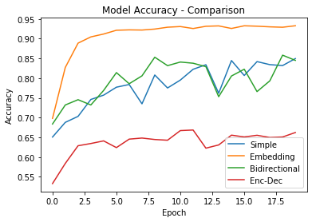

# Machine Translation

The aim of this project is to demonstrate how deep learning techniques can be leveraged to perform the task of machine translation. The training data consists of English phrases and their corresponding French translation and the goal is to train the machine to automatically translate English to French. 

## Dataset

As this is meant to be a demonstration that can be implemented with limited resources, the dataset is also limited in scope and size consists of a few thousand phrases and vocabulary size of ~200 distinct words.

## Expected Outcome

Below is some example output. Note: Due to the limited vocabulary, if the input contains works that are not in the training set the translation will fail. Future work includes handling unknown words.

**Example 1:**
English: He saw a old yellow truck

French: il a vu un vieux camion jaune <PAD> <PAD> <PAD> <PAD> <PAD> <PAD> <PAD> <PAD> <PAD> <PAD> <PAD> <PAD> <PAD> <PAD>

**Example 2:**
English: New Jersey is sometimes calm during the autumn and it is snowy in April

French: new jersey est parfois calme pendant l' automne et il est neigeux en avril <PAD> <PAD> <PAD> <PAD> <PAD> <PAD> <PAD>

## RNN Components and Architectures

Translation is a sequence-to-sequence problem that Recurrent Neural Networks (RNNs) have been shown to solve effectively. Below the different components and architectures are explained.

### Gated Recurrent Units (GRU)

Gated recurrent units (GRUs) are a gating mechanism in recurrent neural networks, introduced in 2014 by Kyunghyun Cho et al. Although LSTM's are very popular and have great performance, in this project GRUs are used as they have been shown to exhibit better performance on smaller datasets. They have fewer parameters than LSTM, as they don't have an output gate.

### Simple RNN

Simple RNNs are when a number of GRU (or other types) nodes are connected in a network. This network can become deep by connecting multiple layers together.

### Bidirectional RNN

One restriction of simple RNNs is that they don't consider future input, only the past. This is where bidirectional recurrent neural networks are better as they are able to see the future data.

### RNN with Embedding layer

Instead of one-hot encoding the data or assigning an id an embedding can be used instead. An embedding is a vector representation of the word that is close to similar words in n-dimensional space, where the n represents the size of the embedding vectors. This has been shown to be a much better representation of the data and scales when the vocabulary is increased. Here, the embedding is learned during training but pre-trained embedding can be used.

### Encoder-Decoder Architecture

This sequence to sequence model doesnt give an output at each step. Instead, the encoder creates a dense representation of the input sentence that is passed into the decoder as input, which in turn predicts the translation as output.

## Performance Comparison

The performance of the above architectures are compared when training with similar hyperparameters. Although that is not the best method for comparing it still gives a good indication. 

Use of embeddings appears to be crucial to effective learning.

For the best performance, a combination of the above techniques was used. Use of embeddings with bidirectional rnn in an encoder-decoder architecture resulted in the best performance for this problem.

