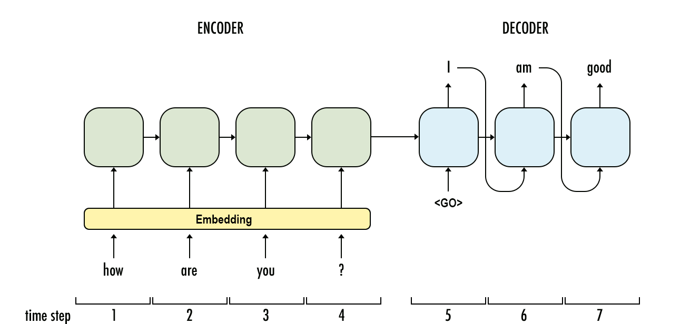

# Machine Translation

## RNN Components and Architectures

### Gated Recurrent Units(GRU)

Gated recurrent units (GRUs) are a gating mechanism in recurrent neural networks, introduced in 2014 by Kyunghyun Cho et al. Although LSTM's are very popular and have great performance, in this project GRUs are used as they have been shown to exhibit better performance on smaller datasets. They have fewer parameters than LSTM, as they don't have an output gate.

### Simple RNN

### Bidirectional RNN

### RNN with Embedding layer

### Encoder-Decoder Architecture

## Performance Comparison

## Additional Work
